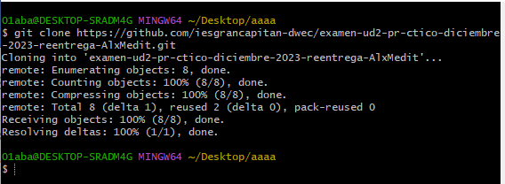

# Examen UD2. Diciembre 2023

Clona este repositorio. Consta de un fichero `"index.html"` y otro `"main.js"`. Las instrucciones están en sus contenidos.

Muestra en este README un pantallazo con los comandos git usados
